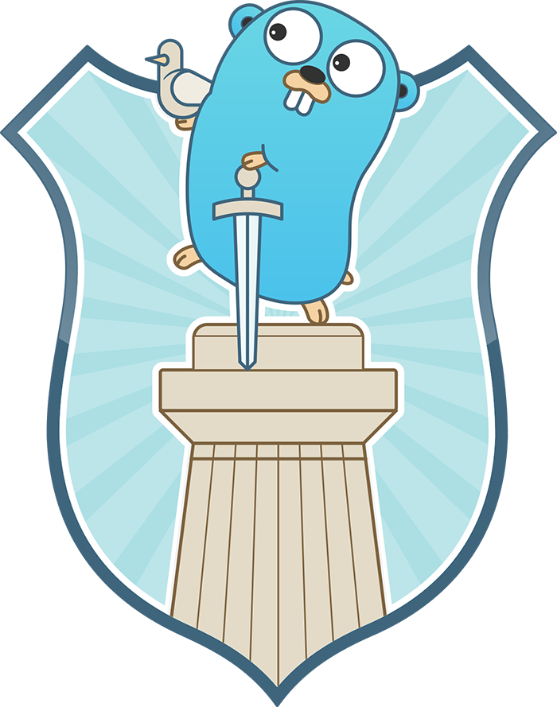

# Go-MVC

Go-MVC is an MVC framework that allows for easy and efficient web development with Go. This framework is designed to be light-weight and modular, making it easy to integrate into any project.

## Structure

The structure of Go-MVC is organized into the following directories:

- assets : Contains all static assets such as images, stylesheets and javascript files.
- config : Contains configuration files such as database configurations, application settings and more.
- controllers : Contains all controller files that are responsible for handling requests and interacting with models.
- models : Contains all model files that are responsible for interacting with the database.
- routes : Contains all route files that define the endpoints and their corresponding functions.
- system : Contains all system files that are responsible for managing the application.
- views : Contains all view files that are responsible for displaying data to the users.

## Third-party dependencies

Go-MVC currently utilizes the following third-party dependencies:

- github.com/go-sql-driver/mysql v1.7.1 : A MySQL driver for Go.
- github.com/gorilla/mux v1.8.0 : A powerful URL router and dispatcher.

## Getting Started

To get started with Go-MVC, you first clone the repository.

```
git clone https://github.com/adandev1125/go-mvc
```

After clone is completed, you can start server with following commands.

```
go run main/main.go
```

## Quick Guide

### Adding Routes

All routes are defined in [routes/routes.go](main/routes/routes.go). You can also use subdirectories to organize yourself.

To add a route, you must define its path and controller.

For example,

``` go
router.HandleFunc("/user/login", controllers.UserLoginHandler).Methods("POST")
```

### Adding Controllers

You can add controllers in controllers folder.

Here is a code snippet for a simple controller.

``` go
func WelcomeHandler(w http.ResponseWriter, r *http.Request) {
	tmpl := template.Must(template.ParseFiles("views/welcome.html"))
	tmpl.Execute(w, nil)
}
```

After finishing your controller, you must add it to the [routes](main/routes/routes.go) to see if it's working correctly.

### Configuring Database

To use database for you app, you have to configure for the database.

You can see the config in [config/database.go](main/config/database.go).

``` go
/**
 * A database config for the app.
 *
 * @param	UseDatabase		True if this application use a database, false if not.
 * @param	Driver			Database driver name. If you use other databases like MongoDB,
 *							you must import the driver in system/database/database.go.
 * @param	Username		Username used to connect to the database.
 * @param	Password		Password used to connect to the database.
 * @param	Host			The database host.
 * @param	Port			The port of database server.const.
 * @param	Database		The database name used for this app.
 */
var DBConfig types.DatabaseConfig = types.DatabaseConfig{
	UseDatabase: true,    //
	Driver:      "mysql", //
	Username:    "root",
	Password:    "",
	Host:        "127.0.0.1",
	Port:        3306,
	Database:    "test",
	ParseTime:   true,
}
```

### Using database

After configuring database in config/database.go, you can use it in any controller or any model.

For example:

``` go
... ... ...

var db = database.GetDatabase()

rows, error := db.Query("SELECT * FROM test_users")

if error != nil {
    log.Fatal(error)
}

defer rows.Close()

... ... ...
```

### Using static files
Static files are stored in [assets](main/assets/) folder.
You can use them in views like this:
``` html
... ... ...

<link rel="stylesheet" type="text/css" href="assets/welcome.css" />

... ... ...



... ... ...
```

### Templating Views
Templating views is supported by the github.com/gorilla/mux v1.8.0 library.

To see more information about this please visit [https://pkg.go.dev/html/template](https://pkg.go.dev/html/template).

### Configuring Environments
To use another port, change the port in the [config](main/config/config.go) file.

For example:
``` go
var PORT = 3000
```

## Conclusion

Go-MVC is a great choice for web development with Go. With its easy-to-use structure and lightweight design, it is a perfect fit for any new or existing project. I hope you find it useful and I look forward to seeing what you create with it!

## Release Notes

### Version 0.0.1
Initial Release.